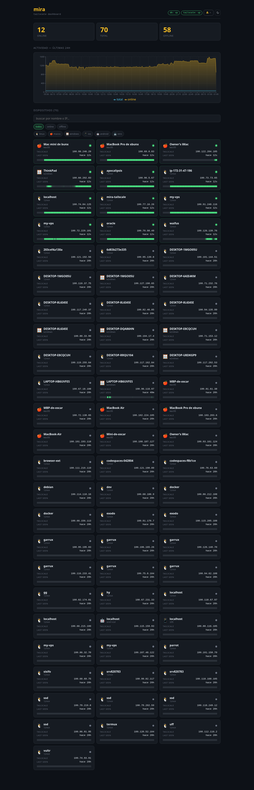
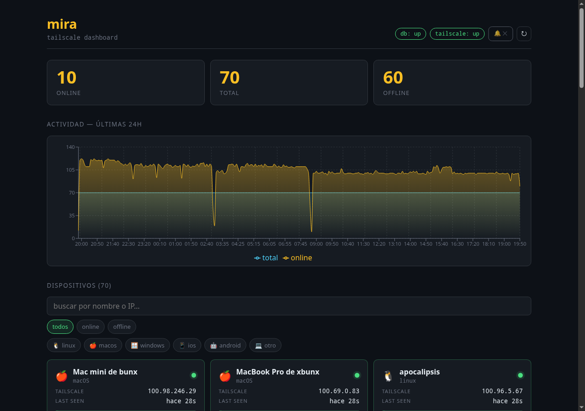

# mira

Dashboard web para visualizar dispositivos Tailscale de tu tailnet — listado en vivo, KPIs (online/offline/total), gráfica de actividad de las últimas 24h e historial persistido en una DB.

## Estructura

```
mira/
├── tailscale.yml             # contenedor con tailscale daemon + bridge HTTP
├── postgres.yml              # base de datos
├── bun.yml                   # backend: poller + REST API
├── vite.yml                  # frontend Vite + React
├── scripts/
│   ├── tailscale/main.sh     # tailscaled userspace + python http server con /status
│   ├── postgres/main.sh
│   ├── bun/main.sh
│   └── vite/main.sh
├── app/                      # backend
│   ├── server.ts
│   └── prisma/schema.prisma  # Device · Snapshot · Event
└── frontend/                 # frontend
    ├── vite.config.ts
    └── src/                  # App.tsx + index.css
```

## Comunicación

Cada `.yml` publica su puerto al host. Los servicios se hablan vía `host.docker.internal:<port>`.

```
browser ──:5174──► vite ──proxy /api──► host:3031 ──► bun ──┬──► host:5433 ──► postgres
                                                            └──► host:41642 ──► tailscale (status)
```

| servicio   | puerto host | rol                                              |
|------------|-------------|--------------------------------------------------|
| tailscale  | `41642`     | tailscaled userspace + HTTP `/status` `/health`  |
| postgres   | `5433`      | DB `mira` (user `mira`)                          |
| bun (API)  | `3031`      | poller cada 30s + REST                           |
| vite (UI)  | `5174`      | UI con cards + recharts                          |

## Auth Tailscale

El contenedor `tailscale` necesita unirse a tu tailnet. Dos opciones:

**Con auth key** (recomendado para automatización — generar en https://login.tailscale.com/admin/settings/keys):

```sh
TS_AUTHKEY=tskey-auth-... docker compose -f tailscale.yml -p mira-ts up -d
```

**Interactivo** (sin `TS_AUTHKEY`): el container imprime una URL en sus logs, ábrela en el navegador y autoriza.

```sh
docker compose -f tailscale.yml -p mira-ts up -d
docker logs -f mira-tailscale  # busca "To authenticate, visit: https://login.tailscale.com/..."
```

El estado se persiste en el volumen `mira_tailscale_state` — solo es necesario autorizar la primera vez.

## Levantar

```sh
TS_AUTHKEY=tskey-auth-... docker compose -f tailscale.yml -p mira-ts up -d
docker compose -f postgres.yml  -p mira-pg   up -d
docker compose -f bun.yml       -p mira-bun  up -d
docker compose -f vite.yml      -p mira-vite up -d
```

UI: `http://localhost:5174`

API directa:

```sh
curl http://localhost:3031/health
curl http://localhost:3031/devices
curl http://localhost:3031/timeline
curl -X POST http://localhost:3031/poll   # forza un poll inmediato
```

## Apagar

```sh
docker compose -f vite.yml      -p mira-vite down
docker compose -f bun.yml       -p mira-bun  down
docker compose -f postgres.yml  -p mira-pg   down       # conserva volumen
docker compose -f tailscale.yml -p mira-ts   down       # conserva tailscale state
```

## Endpoints API

| método | ruta                       | descripción                                    |
|--------|----------------------------|------------------------------------------------|
| GET    | `/`                        | metadata                                       |
| GET    | `/health`                  | db + tailscale status                          |
| GET    | `/devices`                 | listado actual de devices                      |
| GET    | `/devices/:id/history`     | snapshots + events del device en últimas 24h   |
| GET    | `/timeline`                | online/total agregados en buckets 5min, 24h    |
| POST   | `/poll`                    | forza un poll inmediato del bridge tailscale   |

## Modelo de datos

```prisma
model Device   { id, name, os, ipv4, tailnetIp, online, firstSeen, lastSeen, ...relations }
model Snapshot { takenAt, online, rxBytes, txBytes, deviceId }
model Event    { at, kind ("online"|"offline"|"first_seen"), deviceId }
```

El poller corre cada 30s en el backend (`POLL_INTERVAL_MS`). Cada peer del tailnet se upsertea en `Device`, se crea un `Snapshot` con su estado, y cuando hay transición online↔offline se registra un `Event`.

## Stack

- **Tailscale 1.96** — daemon en modo userspace networking dentro del contenedor
- **Bun 1.x** — runtime/bundler/PM (en backend y frontend)
- **Prisma 5** — ORM (`db push`, sin migraciones por ahora)
- **PostgreSQL 15** — base de datos
- **Vite 5 + React 18 + TypeScript** — frontend con HMR
- **Recharts** — gráficas (AreaChart con gradients)

## Screenshots






